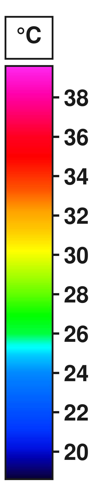

# Thermal temperature scale bar

Recreates the thermal-camera rainbow scale bar as a clean vector/raster graphic,
set in **Nimbus Sans Bold** at a size that stays readable when the bar is
inserted small into a figure.



## Quick start

```bash
pip install matplotlib numpy pillow
sudo apt-get install fonts-urw-base35        # provides Nimbus Sans

python3 make_scale.py                        # -> out/temp_scale.{png,pdf,svg,json}
python3 verify.py out/temp_scale             # check colours against temperatures
```

Defaults: labels beside the bar, range 18.6–39.6 °C, ticks every 2 °C, bar
90 mm tall, 14 pt labels, 600 dpi. That is a 20.7 × 108.1 mm graphic — scale it
to whatever the final figure needs; the PDF and SVG are vector, so it stays
sharp.

## The two layouts

| `--labels outside` (default) | `--labels inside` |
|---|---|
| Numbers beside the bar on the page background. Keeps the bar slim and gives the crispest result when the graphic is shrunk. | Faithful to the original: numbers sit on the gradient, tick dashes bite in from both edges. Each label is automatically black or white depending on the luminance underneath it, with a contrasting outline so it survives being shrunk. |

```bash
python3 make_scale.py --labels inside --out out/temp_scale_inside
```

Both are in `out/`. 14 pt stays comfortably readable down to roughly a 40 mm
tall insert; below that, or if the bar sits on a busy background, bump
`--font-pt` back up.

## Colours really do match temperatures

The gradient is drawn into an axes whose y-limits *are* `[vmin, vmax]`, and the
ticks are placed in those same data coordinates — so registration is exact at
any size or dpi, with no hand-tuned offsets to drift.

`make_scale.py` writes a sidecar `.json` recording the bar's pixel box and the
range. `verify.py` reads it back, samples the rendered PNG at the row each tick
should land on, and compares with the palette:

```
      T   rendered    palette        dR,dG,dB
   20.0    #0009CC    #000BCE     +0,  -2,  -2
   ...
   38.0    #FF00A0    #FF00A1     +0,  +0,  -1
max per-channel error: 2.4/255  ->  OK (tolerance 6)
```

The residual 2/255 is LUT interpolation, not misalignment.

Colour at each tick of the default range:

| T (°C) | colour |
|---:|:---|
| 18.6 | `#070033` |
| 20 | `#000BCE` |
| 22 | `#0050FF` |
| 24 | `#0088FF` |
| 26 | `#00FF3F` |
| 28 | `#61FF00` |
| 30 | `#F3FF00` |
| 32 | `#FFAC00` |
| 34 | `#FF3200` |
| 36 | `#FF0021` |
| 38 | `#FF00A1` |
| 39.6 | `#FF29F1` |

## The palette

`palette.py` defines the rainbow LUT as an HSV schedule over normalised bar
position: hue falls monotonically from 248° (blue) through 0° (red) to −56°
(magenta), with value ramping up from near-black over the bottom 12%. Spacing
of the control points is deliberately uneven — wide blue band, narrow cyan —
to match the source. `palettes/rainbow.csv` is the same thing dumped as
`pos,R,G,B` if you'd rather read or edit numbers.

**This is a reconstruction, matched by eye to a screenshot of the original.**
If you still have the original image file, recover the real LUT exactly:

```bash
python3 extract_palette.py original.png -o palettes/original.csv --range 18.6 39.6
python3 make_scale.py --palette palettes/original.csv
```

`extract_palette.py` finds the bar, samples one colour per row, and ignores the
tick dashes and overlaid labels by discarding near-grey pixels before taking
each row's median. Pass `--bbox x0,y0,x1,y1` if the automatic hunt guesses
wrong.

## Options worth knowing

| flag | default | |
|---|---|---|
| `--range VMIN VMAX` | `18.6 39.6` | temperature span of the bar |
| `--tick-step` / `--ticks` | `2` | automatic spacing, or explicit values |
| `--decimals` | `0` | decimal places on labels |
| `--font-pt` | `14` | label and unit size |
| `--height-mm` | `90` | height of the coloured bar |
| `--bar-width-mm` | fitted | defaults to whatever the labels need |
| `--labels` | `outside` | `outside` or `inside` |
| `--unit` | `°C` | header box text; `--unit ""` to omit |
| `--transparent` | off | no background, for overlaying on an image |
| `--halo-lw` | `2.6` | outline behind inside labels only; `0` disables |
| `--palette` | built-in | CSV of `pos,R,G,B` |
| `--dpi` | `600` | raster resolution |
| `--formats` | `png pdf svg` | |
| `--out` | `out/temp_scale` | basename, no extension |

`--range` is the one to check first: 18.6–39.6 °C is read off the original's
tick spacing, so set it to your own scene's actual min/max.

## Files

```
make_scale.py       renderer (CLI)
palette.py          palette definition, CSV load/save
extract_palette.py  recover the exact LUT from an original screenshot
verify.py           check rendered pixels against the palette
palettes/           rainbow.csv (built-in palette as numbers)
out/                generated PNG / PDF / SVG / JSON
```
